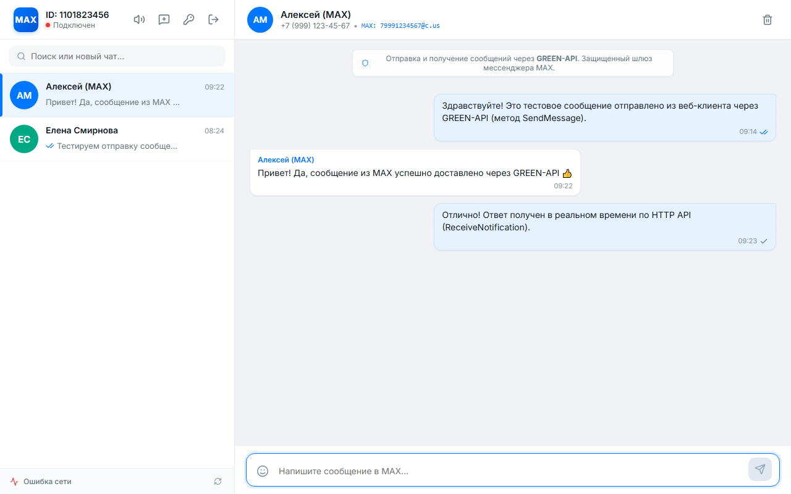
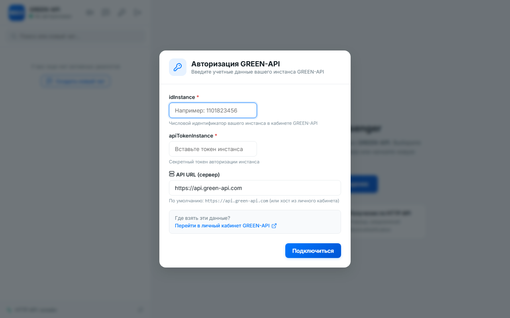

# MAX Web Messenger — Тестовое задание для GREEN-API

Пользовательский веб-интерфейс для отправки и получения сообщений в мессенджере **MAX** (а также WhatsApp/Telegram) через шлюз **[GREEN-API](https://green-api.com/max)**.

Интерфейс спроектирован по образу и подобию официальной веб-версии **[web.max.ru](https://web.max.ru/)** с сохранением простоты, удобства и чистоты кода.

## 📸 Скриншоты интерфейса

| Окно переписки (стиль web.max.ru) |
| :---: |
|  |

| Авторизация GREEN-API | Создание нового чата |
| :---: | :---: |
|  |  |

---

## 🚀 Функциональные возможности

1. **Авторизация в системе GREEN-API:**
   - Ввод учетных данных `idInstance` и `apiTokenInstance`.
   - Возможность указать кастомный `apiUrl` (по умолчанию `https://api.green-api.com`).
   - Автоматическая проверка валидности учетных данных через метод `getStateInstance` перед сохранением.
   - Сохранение учетных данных в `localStorage` (сессия не сбрасывается при перезагрузке страницы).
   - Кнопка смены инстанса и выхода из аккаунта.

2. **Создание и управление чатами:**
   - Модальное окно создания нового чата по номеру телефона получателя.
   - Автоматическая нормализация номеров телефонов: `+7 (999) 123-45-67` или `89991234567` → `79991234567@c.us`.
   - Мгновенный предпросмотр параметров создаваемого чата.
   - Поиск и фильтрация по списку диалогов.
   - Удаление и очистка истории чатов.

3. **Отправка сообщений:**
   - Реализована методом **[`SendMessage`](https://green-api.com/v3/docs/api/sending/SendMessage/)**:
     `POST {{apiUrl}}/waInstance{{idInstance}}/sendMessage/{{apiTokenInstance}}`
   - Оптимистичное обновление интерфейса: сообщение появляется в диалоге мгновенно.
   - Статусы доставки (`отправка`, `отправлено`, `доставлено`, `прочитано`, `ошибка`).
   - Поддержка горячих клавиш: `Enter` для отправки, `Shift + Enter` для новой строки.
   - Быстрая панель эмодзи.

4. **Получение входящих сообщений в реальном времени:**
   - Реализовано по технологии **[HTTP API (Polling)](https://green-api.com/v3/docs/api/receiving/technology-http-api/)**:
     - Получение уведомлений из очереди методом **[`ReceiveNotification`](https://green-api.com/v3/docs/api/receiving/technology-http-api/ReceiveNotification/)**.
     - Подтверждение обработки и удаление из очереди методом **[`DeleteNotification`](https://green-api.com/v3/docs/api/receiving/technology-http-api/DeleteNotification/)**.
   - Обработка входящих текстовых сообщений (`typeWebhook: incomingMessageReceived`).
   - Обработка статусов отправленных сообщений (`typeWebhook: outgoingMessageStatus`).
   - Автоматическое создание чата при получении входящего сообщения от нового контакта.
   - Индикатор активности фонового опроса очереди с отображением статуса подключения.
   - Звуковое оповещение о новых входящих сообщениях (синтезировано через Web Audio API, без внешних файлов).

---

## 🛠 Стек технологий

- **React 18** — компонентная архитектура, хуки (`useState`, `useEffect`, `useCallback`, `useRef`).
- **TypeScript** — строгая типизация данных, запросов и ответов API.
- **Vite** — быстрая сборка, мгновенный HMR (Hot Module Replacement).
- **Lucide React** — минималистичный набор SVG-иконок.
- **Web Audio API** — нативное звуковое уведомление о входящих сообщениях.
- **CSS3 / CSS Variables** — адаптивная стилизация, дизайн-система мессенджера MAX.

---

## 💻 Инструкция для локального запуска

### 1. Предварительные требования
Убедитесь, что на компьютере установлен **Node.js** версии 18 или выше (проверить: `node -v`).

### 2. Клонирование репозитория
```bash
git clone https://github.com/243028429532893727438sdfsfd-create/green-api-max-chat.git
cd green-api-max-chat
```

### 3. Установка зависимостей
```bash
npm install
```

### 4. Запуск в режиме разработки
```bash
npm run dev
```
После запуска откройте в браузере адрес: **`http://localhost:3000`** (или адрес, указанный в терминале).

### 5. Сборка для production
```bash
npm run build
npm run preview
```
Готовая статическая сборка будет находиться в директории `dist/`.

---

## ⚙️ Настройка инстанса в кабинете GREEN-API

Для корректной работы получения сообщений по технологии HTTP API:
1. Войдите в личный кабинет [console.green-api.com](https://console.green-api.com).
2. Выберите ваш инстанс MAX или WhatsApp.
3. Скопируйте **idInstance** и **apiTokenInstance**.
4. В настройках инстанса:
   - Убедитесь, что поле **`webhookUrl`** пустое (чтобы уведомления поступали в очередь HTTP API).
   - Включите опцию **`Получать уведомления о входящих сообщениях и файлах`** (`incomingWebhook: yes`).
   - Нажмите **Сохранить изменения**.

---

## 🌐 Развертывание в Интернете (Deploy)

Проект полностью автономен и не требует стороннего бэкенда, так как серверы GREEN-API поддерживают CORS.
Его можно развернуть на любой статической платформе за пару минут:

- **Vercel / Netlify:**
  1. Импортируйте репозиторий GitHub.
  2. Команда сборки: `npm run build`.
  3. Директория вывода: `dist`.
- **GitHub Pages:**
  Проект уже сконфигурирован с относительными путями (`base: './'` в `vite.config.ts`), что обеспечивает мгновенную работу на GitHub Pages.

---

## 👨‍💻 Автор проекта

- **ФИО:** Пятыров Иван Алексеевич
- **Специализация:** Fullstack / Frontend-разработчик (React)
- **Телефон:** +7 (999) 010-17-50
- **Telegram:** [@Ivan25006](https://t.me/Ivan25006)
- **Email:** VanyaPyatyrov2000@yandex.ru
- **GitHub:** [243028429532893727438sdfsfd-create](https://github.com/243028429532893727438sdfsfd-create)
